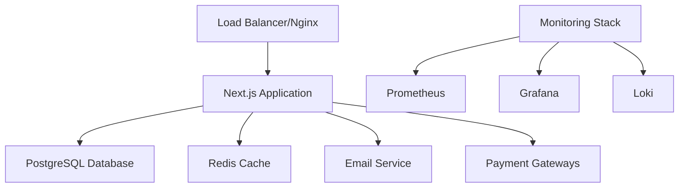

# Troubleshooting and Maintenance Guide - SNPITC Email & Payment System

## Overview

This guide provides comprehensive troubleshooting procedures and maintenance tasks for the SNPITC Email and Payment Management System. It covers common issues, diagnostic procedures, and preventive maintenance.

## System Architecture Overview



## Common Issues and Solutions

### Application Issues

#### Issue: Application Won't Start

**Symptoms:**
- Container fails to start
- Health checks failing
- 502/503 errors from load balancer

**Diagnostic Steps:**

1. **Check Container Status**
```bash
docker-compose -f docker-compose.production.yml ps
docker-compose -f docker-compose.production.yml logs app
```

2. **Verify Environment Variables**
```bash
# Check critical environment variables
echo $DATABASE_URL
echo $NEXTAUTH_SECRET
echo $NEXTAUTH_URL
```

3. **Test Database Connection**
```bash
# Connect to database directly
docker-compose -f docker-compose.production.yml exec postgres psql -U $POSTGRES_USER -d $POSTGRES_DB
```

**Solutions:**

1. **Environment Variable Issues**
```bash
# Reload environment variables
source .env.production
docker-compose -f docker-compose.production.yml restart app
```

2. **Database Connection Issues**
```bash
# Restart database service
docker-compose -f docker-compose.production.yml restart postgres
# Wait for database to be ready
sleep 30
docker-compose -f docker-compose.production.yml restart app
```

3. **Port Conflicts**
```bash
# Check port usage
netstat -tulpn | grep :3000
# Kill conflicting processes
sudo kill -9 <PID>
```

#### Issue: Slow Application Response

**Symptoms:**
- High response times
- Timeouts
- Poor user experience

**Diagnostic Steps:**

1. **Check System Resources**
```bash
# CPU and memory usage
top
htop
docker stats

# Disk usage
df -h
du -sh /var/lib/docker/
```

2. **Database Performance**
```bash
# Connect to database
docker-compose exec postgres psql -U $POSTGRES_USER -d $POSTGRES_DB

-- Check active connections
SELECT count(*) FROM pg_stat_activity;

-- Check slow queries
SELECT query, mean_exec_time, calls 
FROM pg_stat_statements 
ORDER BY mean_exec_time DESC 
LIMIT 10;

-- Check database size
SELECT pg_size_pretty(pg_database_size(current_database()));
```

3. **Application Metrics**
```bash
# Check application logs for errors
docker-compose logs app | grep ERROR

# Monitor API response times
curl -w "@curl-format.txt" -o /dev/null -s "http://localhost:3000/api/health"
```

**Solutions:**

1. **Scale Resources**
```bash
# Increase container resources
# Edit docker-compose.production.yml
services:
  app:
    deploy:
      resources:
        limits:
          memory: 4G
          cpus: '2'
```

2. **Database Optimization**
```sql
-- Vacuum and analyze
VACUUM ANALYZE;

-- Reindex database
REINDEX DATABASE snpitc_production;

-- Update statistics
ANALYZE;
```

3. **Cache Optimization**
```bash
# Clear Redis cache
docker-compose exec redis redis-cli FLUSHALL

# Restart Redis
docker-compose restart redis
```

### Database Issues

#### Issue: Database Connection Errors

**Symptoms:**
- "Connection refused" errors
- "Too many connections" errors
- Application unable to connect to database

**Diagnostic Steps:**

1. **Check Database Status**
```bash
# Check if PostgreSQL is running
docker-compose ps postgres

# Check database logs
docker-compose logs postgres

# Test connection
docker-compose exec postgres pg_isready -U $POSTGRES_USER
```

2. **Check Connection Pool**
```sql
-- Check active connections
SELECT 
    state,
    count(*) 
FROM pg_stat_activity 
GROUP BY state;

-- Check connection limits
SHOW max_connections;
```

**Solutions:**

1. **Restart Database Service**
```bash
docker-compose restart postgres
# Wait for service to be ready
sleep 30
```

2. **Increase Connection Limits**
```bash
# Edit PostgreSQL configuration
# In docker-compose.production.yml
services:
  postgres:
    command: postgres -c max_connections=200
```

3. **Optimize Connection Pool**
```javascript
// In application configuration
const prisma = new PrismaClient({
  datasources: {
    db: {
      url: process.env.DATABASE_URL
    }
  },
  // Optimize connection pool
  __internal: {
    engine: {
      connectionLimit: 20
    }
  }
})
```

#### Issue: Database Performance Problems

**Symptoms:**
- Slow query execution
- High CPU usage on database
- Lock timeouts

**Diagnostic Steps:**

1. **Identify Slow Queries**
```sql
-- Enable query logging
ALTER SYSTEM SET log_min_duration_statement = 1000; -- Log queries > 1 second
SELECT pg_reload_conf();

-- Check slow queries
SELECT 
    query,
    mean_exec_time,
    calls,
    total_exec_time
FROM pg_stat_statements 
ORDER BY mean_exec_time DESC 
LIMIT 10;
```

2. **Check Locks**
```sql
-- Check for locks
SELECT 
    blocked_locks.pid AS blocked_pid,
    blocked_activity.usename AS blocked_user,
    blocking_locks.pid AS blocking_pid,
    blocking_activity.usename AS blocking_user,
    blocked_activity.query AS blocked_statement,
    blocking_activity.query AS current_statement_in_blocking_process
FROM pg_catalog.pg_locks blocked_locks
JOIN pg_catalog.pg_stat_activity blocked_activity ON blocked_activity.pid = blocked_locks.pid
JOIN pg_catalog.pg_locks blocking_locks ON blocking_locks.locktype = blocked_locks.locktype
JOIN pg_catalog.pg_stat_activity blocking_activity ON blocking_activity.pid = blocking_locks.pid
WHERE NOT blocked_locks.granted;
```

**Solutions:**

1. **Optimize Queries**
```sql
-- Add missing indexes
CREATE INDEX CONCURRENTLY idx_emails_created_at ON emails(created_at);
CREATE INDEX CONCURRENTLY idx_payments_student_id ON payments(student_id);

-- Update table statistics
ANALYZE emails;
ANALYZE payments;
```

2. **Database Maintenance**
```sql
-- Regular maintenance
VACUUM ANALYZE;
REINDEX DATABASE snpitc_production;

-- Check for bloat
SELECT 
    schemaname,
    tablename,
    pg_size_pretty(pg_total_relation_size(schemaname||'.'||tablename)) as size
FROM pg_tables 
WHERE schemaname = 'public'
ORDER BY pg_total_relation_size(schemaname||'.'||tablename) DESC;
```

### Email System Issues

#### Issue: Email Delivery Failures

**Symptoms:**
- Emails not being sent
- High bounce rates
- SMTP errors

**Diagnostic Steps:**

1. **Check SMTP Configuration**
```bash
# Test SMTP connection
telnet $SMTP_HOST $SMTP_PORT

# Check application logs
docker-compose logs app | grep SMTP
```

2. **Verify DNS Configuration**
```bash
# Check MX records
dig MX institute.edu

# Check SPF records
dig TXT institute.edu | grep spf

# Check DKIM records
dig TXT default._domainkey.institute.edu
```

**Solutions:**

1. **Fix SMTP Configuration**
```bash
# Update environment variables
# In .env.production
SMTP_HOST=smtp.your-domain.com
SMTP_PORT=587
SMTP_USER=noreply@your-domain.com
SMTP_PASSWORD=your-smtp-password

# Restart application
docker-compose restart app
```

2. **DNS Configuration**
```bash
# Add SPF record
# TXT record: "v=spf1 include:_spf.your-domain.com ~all"

# Add DKIM record
# TXT record for default._domainkey: "v=DKIM1; k=rsa; p=YOUR_PUBLIC_KEY"

# Add DMARC record
# TXT record for _dmarc: "v=DMARC1; p=quarantine; rua=mailto:dmarc@your-domain.com"
```

#### Issue: Email Account Creation Failures

**Symptoms:**
- Cannot create new email accounts
- Account creation errors
- Database constraint violations

**Diagnostic Steps:**

1. **Check Database Constraints**
```sql
-- Check for duplicate emails
SELECT email, count(*) 
FROM email_accounts 
GROUP BY email 
HAVING count(*) > 1;

-- Check constraint violations
SELECT conname, contype 
FROM pg_constraint 
WHERE conrelid = 'email_accounts'::regclass;
```

2. **Verify Email Domain**
```bash
# Check domain configuration
echo $EMAIL_DOMAIN
```

**Solutions:**

1. **Fix Duplicate Emails**
```sql
-- Remove duplicates (keep the latest)
DELETE FROM email_accounts 
WHERE id NOT IN (
    SELECT DISTINCT ON (email) id 
    FROM email_accounts 
    ORDER BY email, created_at DESC
);
```

2. **Update Domain Configuration**
```bash
# In .env.production
EMAIL_DOMAIN=institute.edu
```

### Payment System Issues

#### Issue: Payment Gateway Failures

**Symptoms:**
- Payment processing errors
- Gateway timeout errors
- Transaction failures

**Diagnostic Steps:**

1. **Check Gateway Status**
```bash
# Test gateway connectivity
curl -I https://api.razorpay.com/v1/
curl -I https://api.stripe.com/v1/

# Check application logs
docker-compose logs app | grep -i payment
```

2. **Verify Gateway Configuration**
```bash
# Check environment variables
echo $RAZORPAY_KEY_ID
echo $STRIPE_PUBLISHABLE_KEY
# Don't echo secrets in production!
```

**Solutions:**

1. **Update Gateway Configuration**
```bash
# Verify API keys are correct
# Test with gateway's test endpoints first

# Update configuration
# In .env.production
RAZORPAY_KEY_ID=rzp_live_correct_key
RAZORPAY_KEY_SECRET=correct_secret
```

2. **Implement Retry Logic**
```javascript
// Add retry mechanism for failed payments
const retryPayment = async (paymentData, maxRetries = 3) => {
  for (let attempt = 1; attempt <= maxRetries; attempt++) {
    try {
      return await processPayment(paymentData)
    } catch (error) {
      if (attempt === maxRetries) throw error
      await new Promise(resolve => setTimeout(resolve, 1000 * attempt))
    }
  }
}
```

#### Issue: Transaction Data Inconsistencies

**Symptoms:**
- Mismatched transaction records
- Duplicate transactions
- Missing payment confirmations

**Diagnostic Steps:**

1. **Check Transaction Integrity**
```sql
-- Check for duplicate transactions
SELECT transaction_id, count(*) 
FROM payments 
GROUP BY transaction_id 
HAVING count(*) > 1;

-- Check orphaned records
SELECT p.* 
FROM payments p 
LEFT JOIN email_accounts ea ON p.student_id = ea.id 
WHERE ea.id IS NULL;
```

**Solutions:**

1. **Data Cleanup**
```sql
-- Remove duplicate transactions (keep the latest)
DELETE FROM payments 
WHERE id NOT IN (
    SELECT DISTINCT ON (transaction_id) id 
    FROM payments 
    ORDER BY transaction_id, created_at DESC
);

-- Fix orphaned records
UPDATE payments 
SET student_id = NULL 
WHERE student_id NOT IN (SELECT id FROM email_accounts);
```

## Preventive Maintenance

### Daily Tasks

1. **System Health Check**
```bash
#!/bin/bash
# daily-health-check.sh

echo "=== Daily Health Check $(date) ==="

# Check service status
docker-compose -f docker-compose.production.yml ps

# Check disk space
df -h

# Check memory usage
free -h

# Check application health
curl -f http://localhost:3000/api/health

# Check database connections
docker-compose exec postgres psql -U $POSTGRES_USER -d $POSTGRES_DB -c "SELECT count(*) FROM pg_stat_activity;"

echo "=== Health Check Complete ==="
```

2. **Log Review**
```bash
#!/bin/bash
# daily-log-review.sh

# Check for errors in application logs
docker-compose logs --since 24h app | grep -i error

# Check for failed payments
docker-compose logs --since 24h app | grep -i "payment.*failed"

# Check for authentication failures
docker-compose logs --since 24h app | grep -i "auth.*failed"
```

### Weekly Tasks

1. **Database Maintenance**
```sql
-- weekly-db-maintenance.sql

-- Update table statistics
ANALYZE;

-- Check for bloated tables
SELECT 
    schemaname,
    tablename,
    pg_size_pretty(pg_total_relation_size(schemaname||'.'||tablename)) as size,
    pg_size_pretty(pg_relation_size(schemaname||'.'||tablename)) as table_size,
    pg_size_pretty(pg_total_relation_size(schemaname||'.'||tablename) - pg_relation_size(schemaname||'.'||tablename)) as index_size
FROM pg_tables 
WHERE schemaname = 'public'
ORDER BY pg_total_relation_size(schemaname||'.'||tablename) DESC;

-- Vacuum analyze large tables
VACUUM ANALYZE emails;
VACUUM ANALYZE payments;
VACUUM ANALYZE email_accounts;
```

2. **Security Review**
```bash
#!/bin/bash
# weekly-security-review.sh

# Check for failed login attempts
docker-compose logs --since 7d app | grep -i "login.*failed" | wc -l

# Check for suspicious activities
docker-compose logs --since 7d app | grep -i "suspicious\|anomaly\|threat"

# Review admin actions
docker-compose exec postgres psql -U $POSTGRES_USER -d $POSTGRES_DB -c "
SELECT action, count(*) 
FROM admin_audit_logs 
WHERE created_at > NOW() - INTERVAL '7 days' 
GROUP BY action 
ORDER BY count(*) DESC;"
```

### Monthly Tasks

1. **Performance Review**
```bash
#!/bin/bash
# monthly-performance-review.sh

# Generate performance report
echo "=== Monthly Performance Report $(date) ==="

# Database performance
docker-compose exec postgres psql -U $POSTGRES_USER -d $POSTGRES_DB -c "
SELECT 
    query,
    calls,
    total_exec_time,
    mean_exec_time,
    stddev_exec_time
FROM pg_stat_statements 
ORDER BY total_exec_time DESC 
LIMIT 10;"

# System resource usage
echo "Average CPU usage over last month:"
# Add monitoring query here

echo "Average memory usage over last month:"
# Add monitoring query here
```

2. **Backup Verification**
```bash
#!/bin/bash
# monthly-backup-verification.sh

# Test latest backup
LATEST_BACKUP=$(ls -t /backups/*.sql | head -n 1)
echo "Testing backup: $LATEST_BACKUP"

# Create test database
createdb test_restore_$(date +%Y%m%d)

# Restore backup
psql test_restore_$(date +%Y%m%d) < $LATEST_BACKUP

# Verify data integrity
psql test_restore_$(date +%Y%m%d) -c "SELECT count(*) FROM email_accounts;"
psql test_restore_$(date +%Y%m%d) -c "SELECT count(*) FROM payments;"

# Cleanup test database
dropdb test_restore_$(date +%Y%m%d)

echo "Backup verification complete"
```

### Quarterly Tasks

1. **Security Audit**
```bash
#!/bin/bash
# quarterly-security-audit.sh

# Check SSL certificate expiration
echo "SSL Certificate Status:"
echo | openssl s_client -servername your-domain.com -connect your-domain.com:443 2>/dev/null | openssl x509 -noout -dates

# Review user access
docker-compose exec postgres psql -U $POSTGRES_USER -d $POSTGRES_DB -c "
SELECT 
    email,
    role,
    last_login,
    created_at
FROM users 
WHERE role = 'ADMIN'
ORDER BY last_login DESC;"

# Check for unused accounts
docker-compose exec postgres psql -U $POSTGRES_USER -d $POSTGRES_DB -c "
SELECT 
    email,
    last_login,
    created_at
FROM email_accounts 
WHERE last_login < NOW() - INTERVAL '90 days'
OR last_login IS NULL;"
```

2. **Capacity Planning**
```bash
#!/bin/bash
# quarterly-capacity-planning.sh

# Database growth analysis
docker-compose exec postgres psql -U $POSTGRES_USER -d $POSTGRES_DB -c "
SELECT 
    'emails' as table_name,
    count(*) as row_count,
    pg_size_pretty(pg_total_relation_size('emails')) as size
FROM emails
UNION ALL
SELECT 
    'payments' as table_name,
    count(*) as row_count,
    pg_size_pretty(pg_total_relation_size('payments')) as size
FROM payments;"

# Storage usage trends
df -h | grep -E '/$|/var'

# Memory usage trends
free -h
```

## Emergency Procedures

### System Recovery

1. **Complete System Failure**
```bash
#!/bin/bash
# emergency-recovery.sh

echo "=== Emergency System Recovery ==="

# Stop all services
docker-compose -f docker-compose.production.yml down

# Check system resources
df -h
free -h

# Start core services first
docker-compose -f docker-compose.production.yml up -d postgres redis

# Wait for databases to be ready
sleep 60

# Start application
docker-compose -f docker-compose.production.yml up -d app

# Start monitoring
docker-compose -f docker-compose.production.yml up -d prometheus grafana

# Verify system health
sleep 30
curl -f http://localhost:3000/api/health
```

2. **Data Recovery**
```bash
#!/bin/bash
# emergency-data-recovery.sh

# Find latest backup
LATEST_BACKUP=$(ls -t /backups/*.sql | head -n 1)
echo "Using backup: $LATEST_BACKUP"

# Stop application to prevent data corruption
docker-compose -f docker-compose.production.yml stop app

# Restore database
docker-compose exec postgres psql -U $POSTGRES_USER -d $POSTGRES_DB < $LATEST_BACKUP

# Restart application
docker-compose -f docker-compose.production.yml start app

# Verify data integrity
curl -f http://localhost:3000/api/health
```

### Contact Information

**Emergency Contacts:**
- System Administrator: admin@institute.edu
- Database Administrator: dba@institute.edu
- Security Team: security@institute.edu
- On-call Support: +1-555-SUPPORT

**Escalation Procedures:**
1. Level 1: System Administrator
2. Level 2: Technical Lead
3. Level 3: CTO/IT Director
4. Level 4: External Support

For additional troubleshooting assistance, refer to the system logs, monitoring dashboards, and contact the appropriate support team based on the issue severity.
